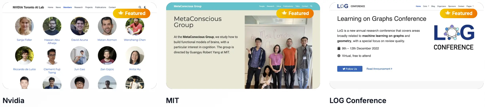

[_English_](./README.md)

<p align="center">
  <a href="https://hugoblox.com/start?utm_source=github&utm_medium=readme">
    
  </a>
</p>

<h1 align="center">技术/学术网站的开源王牌工具箱</h1>

<p align="center">
  <strong>效率拉满：</strong> 几分钟上线，性能和 SEO 都很能打。<br/>
  <!-- 受到 250,000+ 创新者青睐（Meta、Stanford、Google、MIT、OpenAI 等）。 -->
</p>

<p align="center">
  <a href="https://hugoblox.com/start?utm_source=github&utm_medium=readme"><b>🚀 免费开始</b></a>
  &nbsp;•&nbsp;
  <a href="https://hugoblox.com/pro?utm_source=github&utm_medium=readme"><b>立即升级 Pro（终身）</b></a>
  <!-- &nbsp;•&nbsp;
  <a href="https://discord.gg/z8wNYzb">加入 Discord</a> -->
</p>

<p align="center">
  <a href="https://discord.gg/z8wNYzb">
    
  </a>
  <a href="https://github.com/HugoBlox/hugo-blox-builder">
    
  </a>
  <a href="https://github.com/gcushen">
    
  </a>
</p>

---

## 为什么选 Hugo Blox？

- **分钟级上线，不再内耗：** 选模板 → 拖拽积木 → 发布。SaaS 落地页、在线课程、学术简历、实验室主页… 都能一把梭。
- **完全掌控内容与品牌：** 纯静态输出，无厂商锁定，轻松冲 100/100 Lighthouse 分数。内容归你，你做主。
- **技术范儿十足：** Hugo + Tailwind CSS 现代栈。支持 Markdown、Jupyter、BibTeX，出版物自动同步，工作流丝滑顺手。
- **开源且可扩展：** MIT 核心慷慨开源。可用 React “小岛”增强交互，或升级 Pro 解锁更多专业模板与积木。

<p align="center">
  
</p>

<p align="center">
  <a href="https://hugoblox.com/templates?utm_source=github&utm_medium=readme"><b>浏览模板 →</b></a>
</p>

---

## 快速上手

**推荐（最快、零安装）：**  
👉 [**浏览器里直接开干**](https://hugoblox.com/start?utm_source=github&utm_medium=readme) — 选模板、改积木、发布到 GitHub Pages。

**命令行选手？**  
使用本地快速开始：

```bash
# 1) 安装 Hugo Extended → https://docs.hugoblox.com/getting-started/install-hugo/#prerequisites

# 2) 克隆一个起步模板（示例：Academic CV）- 更多模板见 https://hugoblox.com/templates
git clone https://github.com/HugoBlox/theme-academic-cv my-site
cd my-site

# 3) 本地运行
pnpm install && hugo server -D
```

更多指南请访问文档 [**https://docs.hugoblox.com/**](https://docs.hugoblox.com/?utm_source=github&utm_medium=readme)。

---

## Free vs. Pro

Hugo Blox 自带一套用于 Hero、Features、Testimonials、FAQs 等的**免费积木**。**Pro** 为一次性捐赠，解锁**独家、专业设计的高级积木**与整站模板，助你更快更稳地上线。

- 免费模板与积木：[**模板目录**](https://hugoblox.com/templates?utm_source=github&utm_medium=readme)
- Pro 目录与终身更新：[**立即升级 Pro（终身）**](https://hugoblox.com/pro?utm_source=github&utm_medium=readme)

---

## 创作者怎么说

> “Hugo Blox 直接帮我省了 40+ 小时做实验室网站。BibTeX 自动同步出版物 —— **引用量提升了 3×**。”
> —— **Sarah Yang 博士**，AI 研究者

> “我们 10 分钟就把文档站点上线了。积木系统太妙了；**新同学上手时间缩短了 60%**。”
> —— **Alexandre Rodrigues**，创始人

---

## 支持这个项目

- 💎 **Pro（一次性捐赠）** — 终身获取全部高级模板、积木与更新。
  <br/>[**立即升级 Pro（终身）→**](https://hugoblox.com/pro?utm_source=github&utm_medium=readme)

- ☕️ **请我们喝杯咖啡** — 支持开源与开放科研。
  <br/>[**GitHub 赞助 →**](https://github.com/sponsors/gcushen)

- 🤝 **企业赞助** — 触达成千上万开发者与研究者。你的 Logo 将展示在此 README。
  <br/>[**成为合作伙伴 →**](https://github.com/sponsors/gcushen)

---

## 社区

欢迎加入社区提问、分享与共建。

- 💬 [Discord](https://discord.gg/z8wNYzb)
- 📚 [文档与指南](https://docs.hugoblox.com/?utm_source=github&utm_medium=readme)
- 🐦 [X / Twitter](https://x.com/BuildLore)
- ⭐ [为 Hugo Blox 加星](https://github.com/HugoBlox/hugo-blox-builder)

---

## 许可证

MIT © 2016–至今 [George Cushen](https://georgecushen.com?utm_source=github&utm_medium=hbb-readme) — [License 详情](./LICENSE.md)

<p align="center">
  <sub>无追踪。无锁定。你的内容，始终属于你。</sub>
</p>
