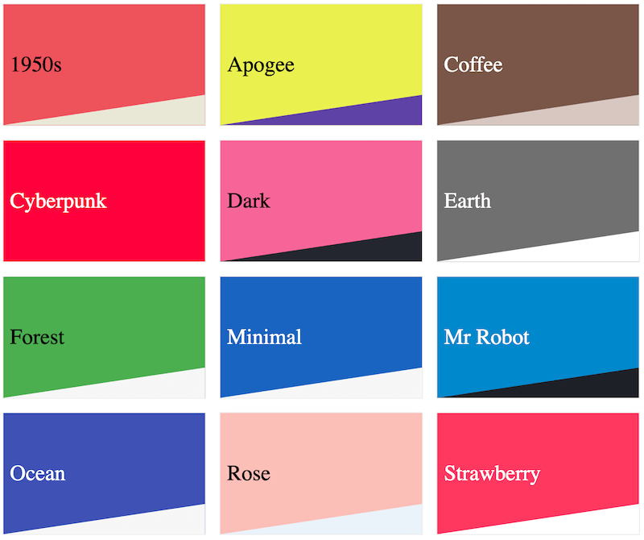

[**English**](./README.md)

# [Hugo Blox Builder](https://hugoblox.com): 全能网站构建工具

### 加入 750,000+ 站点。零代码。轻松创建面向未来的网站✏️ 📰 🚀

🔥 **1. 使用 [Hugo](https://gohugo.io) 引擎支持的模块，免费创建_任何_类型的网站** - 从登录页面、知识库和课程到专业简历、会议和技术博客

🎨 **2. 个性化**漂亮的起始模板，享有**50+种浅色/深色主题、多语言包和模块**

🛋 **3. 可选地，使用基于 [Decap CMS](https://docs.hugoblox.com/getting-started/cms/decap/) 的开源内容管理系统（CMS），随时随地从沙发上或外出写作**

[查看最新的 **演示**](https://hugoblox.com/templates/)，在不到 60 秒内获取您将获得的内容，或者获得其他创作者的 [**灵感**](https://hugoblox.com/creators/)。

- 👉 [**开始使用**](https://hugoblox.com/templates/)
- 📚 [查看 **文档**](https://docs.hugoblox.com/)
- 🙋‍♀️ **有问题吗？**
  - **立即在 [Discord](https://discord.gg/z8wNYzb) 上与我们聊天**，或浏览 [故障排除指南](https://docs.hugoblox.com/reference/troubleshooting/) 和 [问答论坛](https://github.com/HugoBlox/hugo-blox-builder/discussions)
  - _此外，查看 [Hugo 论坛](https://discourse.gohugo.io) 解决 Hugo 相关问题，以及 [Netlify 论坛](https://answers.netlify.com/) 解答 Netlify 相关问题_
- 🐦 与社区共享您的 Hugo Blox Builder 网站：[@GetResearchDev](https://twitter.com/GetResearchDev) [@GeorgeCushen](https://twitter.com/GeorgeCushen) [#MadeWithHugoBlox](https://twitter.com/search?q=%23MadeWithHugoBlox&src=typed_query)
- 🗳 [参加调查，帮助我们改进 #开源](https://forms.gle/NioD9VhUg7PNmdCAA)
- ⬆️ **更新？** 查看 [更新指南](https://docs.hugoblox.com/reference/update/) 和 [发布说明](https://github.com/HugoBlox/hugo-blox-builder/releases)
- 🚀 [贡献改进](CONTRIBUTING.md) 或 [建议改进](https://github.com/HugoBlox/hugo-blox-builder/issues)

## 💙 我们向您恳请支持这个开源运动

今天我们请求您捍卫 Hugo Blox Builder 网站构建工具和主题的开源独立性 🐧

我们是一个**开源和开放科学的运动**，依靠您的支持来保持在线和繁荣，但我们的 99.9% 的创作者没有做出贡献，他们只是选择置之不理 🤦🏻‍♀️

### [😍️ 点击此处成为 GitHub 赞助者，解锁令人惊叹的特权，如 _独家模板、小部件和教程_](https://github.com/sponsors/gcushen)

### 商业赞助者

  

    
  

  

    
  

## 起始模板

Hugo Blox Builder 是一个使用**小部件**创建_任何_类型网站的**零代码**框架。每个网站都是 100% 可自定义，使其成为您的专属网站！

选择一个起始模板，轻松上手：

## 技术内容撰写的未来

使用标准化的 Markdown 和捆绑的扩展（包括数学和图表）**编写丰富、具备未来性的内容**。可以在开源 CMS 中编辑，也可以通过在线的 GitHub 编辑器、Jupyter Notebook 或 RStudio 进行编辑！[了解更多](https://docs.hugoblox.com/reference/markdown/)

## 特点

**主要特点：**- **页面构建器** - 使用[小部件](https://docs.hugoblox.com/getting-started/page-builder/)和[元素](https://docs.hugoblox.com/reference/markdown/)创建_任何东西_
- **编辑任何类型的内容** - 博客文章、出版物、演讲、幻灯片、项目等等！
- 使用 [**Markdown**](https://docs.hugoblox.com/reference/markdown/)、[**Jupyter**](https://docs.hugoblox.com/getting-started/cms/) 或 [**RStudio**](https://docs.hugoblox.com/getting-started/cms/rstudio/) 创建内容
- **插件系统** - 完全可定制的[**颜色**和**字体主题**](https://docs.hugoblox.com/getting-started/customize/#appearance)
- **显示代码和数学公式** - 支持代码高亮和[LaTeX数学](https://docs.hugoblox.com/reference/markdown/#math)
- **集成** - [Google Analytics](https://analytics.google.com)、[Disqus评论](https://disqus.com)、地图、联系表单等等！
- **美丽的网站** - 简单清爽的单页设计
- **行业领先的SEO** - 帮助您的网站在搜索引擎和社交媒体上被发现
- **媒体图库** - 在可定制的图库中显示带标题的图像和视频
- **移动友好** - 适用于各种屏幕的移动友好版本，外观令人惊艳
- **多语言** - 35+语言包，包括英文、中文和葡萄牙文
- **多用户** - 每个作者都有自己的个人资料页面
- **隐私保护套件** - 协助符合GDPR
- **脱颖而出** - 使用动画、视差背景和滚动效果使您的网站生动起来
- **一键部署** - 无需服务器、无需数据库，只有文件。

## 主题

Hugo Blox Builder内置了**自动白天（浅色）和黑夜（暗色）模式**。或者，单击[Demos](https://hugoblox.com/templates/)右上角的月亮图标设置您喜欢的模式！

为您的网站选择一个惊艳的主题，并[自定义它](https://docs.hugoblox.com/getting-started/customize/#custom-theme)以满足您的喜好：

[浏览更多模板和主题...](https://hugoblox.com/templates/)

## 生态系统

- [**Academic File Converter**](https://github.com/GetRD/academic-file-converter)：自动将学术出版物从BibTeX导入到Markdown文件
- [**Awesome Hugo**](https://github.com/HugoBlox/awesome-hugo)：帮助将内容迁移到Hugo的新版本的脚本

## 加入社区

请随意在Github上[_star_该项目](https://github.com/HugoBlox/hugo-blox-builder)，在Discord上[join the community](https://discord.gg/z8wNYzb)，并关注Twitter上的[@GetResearchDev](https://twitter.com/GetResearchDev)，第一时间获取新功能的消息。

## 许可证

版权所有 2016-present [George Cushen](https://georgecushen.com)。

[Hugo Blox Builder](https://github.com/HugoBlox/hugo-blox-builder/)存储库根据[MIT](https://github.com/HugoBlox/hugo-blox-builder/blob/main/LICENSE.md)许可证发布。
