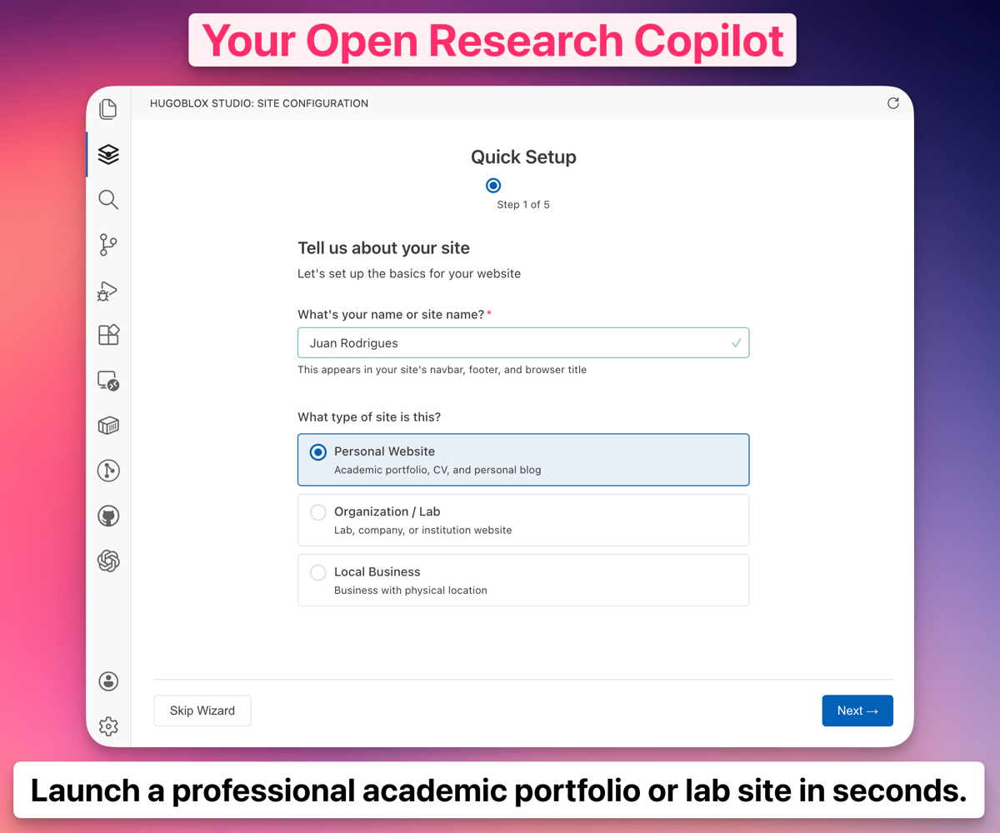
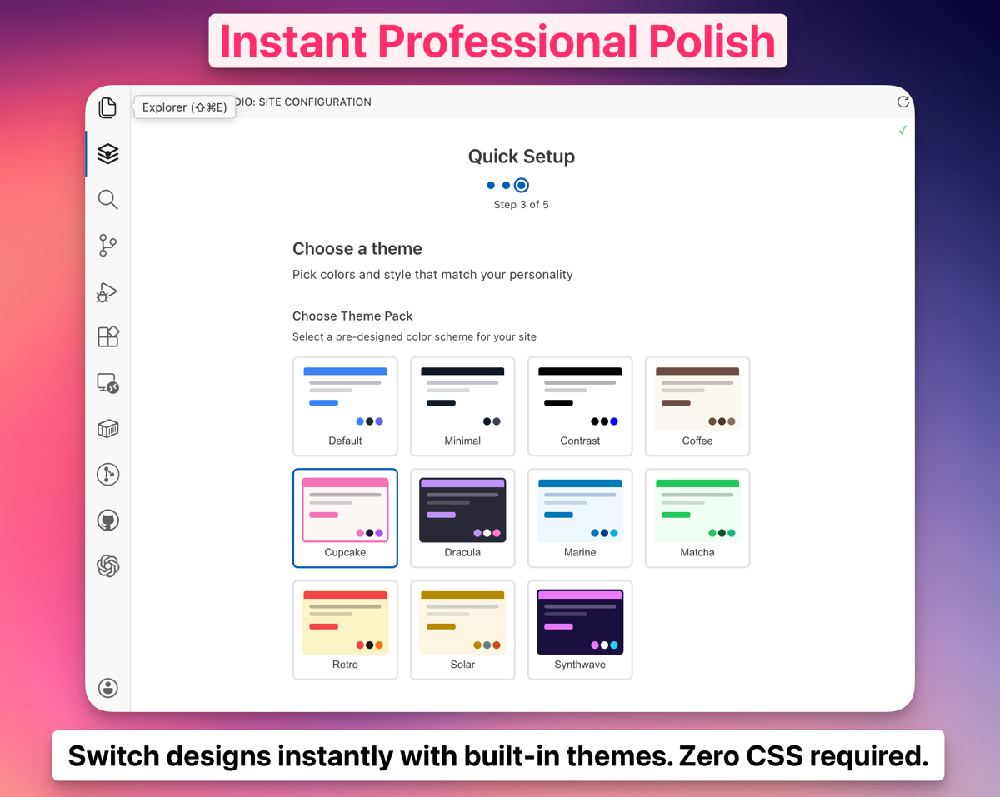
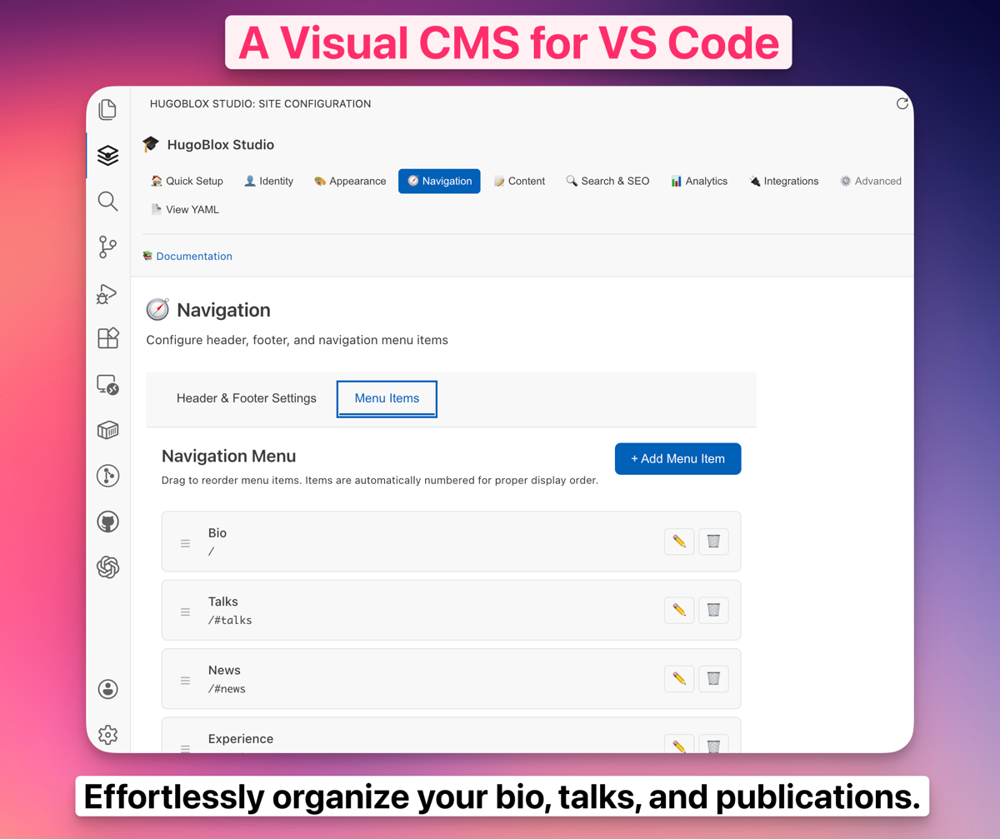

[_English_](./README.md)

<p align="center">
  <a href="https://hugoblox.com/start?utm_source=github&utm_medium=readme">
    
  </a>
</p>

<h1 align="center">HugoBlox: 您的开源科研副驾驶</h1>

<p align="center">
  <strong>在 AI 时代打造「面向未来」的品牌。</strong><br/>
  <strong>Meta, Stanford, NVIDIA, 和 Y Combinator</strong> 的顶尖研究者与创始人的共同选择。
</p>

<p align="center">
  <a href="https://hugoblox.com/start?utm_source=github&utm_medium=readme"><b>🚀 启动 Copilot（免费）</b></a>
  &nbsp;•&nbsp;
  <a href="https://hugoblox.com/pro?utm_source=github&utm_medium=readme">升级 Pro</a>
</p>

<p align="center">
  <a href="https://discord.gg/z8wNYzb">
    
  </a>
  <a href="https://github.com/HugoBlox/kit">
    
  </a>
  <a href="https://x.com/BuildLore">
    
  </a>
</p>

---

## 为什么顶尖人才选择 HugoBlox

在 AI Agent 时代，**Markdown 正成为新的源代码**。HugoBlox 赋能 STEM 研究人员、数据科学家、创新实验室和 YC 创业公司，无需繁琐代码即可创建令人惊叹的高影响力网站。

Vibe coding 工具生成的 React/JS 代码通常脆弱且难以维护，如同「黑盒」。**HugoBlox** 结合了 AI 的速度与静态站点的稳健性，现更通过 **HugoBlox Studio** —— 您在 VS Code 中的可视化 UI 编辑器 —— 得到全面增强。

- **🔮 面向未来 & AI 就绪:** 内容即干净的 Markdown —— 人类和 LLM 均可读。无厂商锁定。
- **🧠 「副驾驶」工作流:**
  - **在线版:** AI 辅助部署器，60 秒内上线。
  - **VS Code 版:** 隆重介绍 **HugoBlox Studio** —— 直接在 IDE 中进行可视化编辑、实时预览和智能配置。
- **⚡ 无技术债的极致性能:** 完美的 Lighthouse 分数，零 JS 臃肿，由 Tailwind 4 和 Hugo Modules 驱动。
- **🎓 科研级特性:** LaTeX、BibTeX 自动引用、Jupyter 集成 —— 放大您的研究成果。


*几分钟内构建惊艳的科研作品集 —— 专注于突破，而非代码。*


*即时预览与智能建议 —— 轻松提升您的站点。*


*VS Code 中的可视化 CMS —— 发现即所得，告别部署苦役。*

<p align="center">
  <a href="https://marketplace.visualstudio.com/items?itemName=hugoblox.hugoblox-studio"><b>📥 立即下载 HugoBlox Studio (免费)</b></a>
</p>

<p align="center">
  
</p>

<p align="center">
  <a href="https://hugoblox.com/templates?utm_source=github&utm_medium=readme"><b>浏览模板 →</b></a>
</p>

---

## 快速上手

### 方案一：在线 Copilot（最快）
为您的实验室、创业公司或个人简介发布专业网站，仅需不到 2 分钟。

👉 [**在浏览器中免费开始**](https://hugoblox.com/start?utm_source=github&utm_medium=readme)

### 方案二：VS Code 中的 HugoBlox Studio（可视化利器）
使用我们的 VS Code 扩展超级充能您的工作流 —— 专为专业人士打造的可视化编辑。

1. 从 [VS Code Marketplace](https://marketplace.visualstudio.com/items?itemName=hugoblox.hugoblox-studio) 安装。
2. 在 VS Code 中打开您的 HugoBlox 项目。
3. 点击 HugoBlox 图标，开始可视化构建！

### 方案三：CLI（开发者专用）
偏爱终端？使用我们的本地副驾驶搭建骨架：

```bash
npx hugoblox create
```

*前置条件: [Hugo Extended & Node](https://docs.hugoblox.com/start/cli/).*

更多指南，请访问文档 [**docs.hugoblox.com**](https://docs.hugoblox.com/?utm_source=github&utm_medium=readme)。

---

## 免费版 vs. Pro 版

**HugoBlox** 采用 Open Core 模式。您可以用开源版免费搭建世界级站点。**Pro** 版通过 Studio 和高级功能为您加速。

| 功能 | 开源版 | **HugoBlox Pro** |
| :--- | :---: | :---: |
| **核心框架** | ✅ | ✅ |
| **Studio 站点编辑器** | ❌ | **✅ 包含** |
| **高级整站模板** (SaaS, 实验室) | ❌ | **✅ 包含** |
| **独家 Pro 积木** | ❌ | **✅ 包含** |
| **移除归属声明?** | ❌ | **✅ 包含** |
| **Discord 支持** | ❤️ | **⚡️ 优先支持** |
| **支持开放科研** | ❤️ | **🏆 Hero 身份** |

👉 [**升级 Pro**](https://hugoblox.com/pro?utm_source=github&utm_medium=readme)

---

## 创作者怎么说

> "HugoBlox Studio 直接帮我省了 40+ 小时做实验室网站。可视化编辑 + BibTeX 自动更新 = **引用量提升了 3 倍**。"
> — **Dr. Sarah Yang**, AI 研究者

> "用 Studio 10 分钟就把文档站点上线了。积木系统太妙了；新手上手时间缩短了 60%。"
> — **Alexandre Rodrigues**, 创始人

---

## 支持这个项目

- 💎 **Pro (仅需 $8/月)** — 解锁 Studio, 高级模板，以及所有更新。
  <br/>[**升级 Pro →**](https://hugoblox.com/pro?utm_source=github&utm_medium=readme)

- ☕️ **请喝杯咖啡** — 支持开源与科研。
  <br/>[**GitHub 赞助 →**](https://github.com/sponsors/gcushen)

- 🤝 **企业赞助** — 触达成千上万开发者与研究者。您的 Logo 将展示在此。
  <br/>[**成为合作伙伴 →**](https://github.com/sponsors/gcushen)

---

## 社区

加入社区提问、分享作品与共同进步。

- 💬 [Discord](https://discord.gg/z8wNYzb)
- 📚 [文档与指南](https://docs.hugoblox.com/?utm_source=github&utm_medium=readme)
- 🐦 [X / Twitter](https://x.com/BuildLore)
- ⭐ [为 HugoBlox 加星](https://github.com/HugoBlox/kit)

---

## 许可证

MIT © 2016–Present [George Cushen](https://georgecushen.com/?utm_source=github&utm_medium=hbb-readme) — [License 详情](./LICENSE.md)

<p align="center">
  <sub>无追踪。无锁定。您的内容始终属于您。</sub>
</p>
