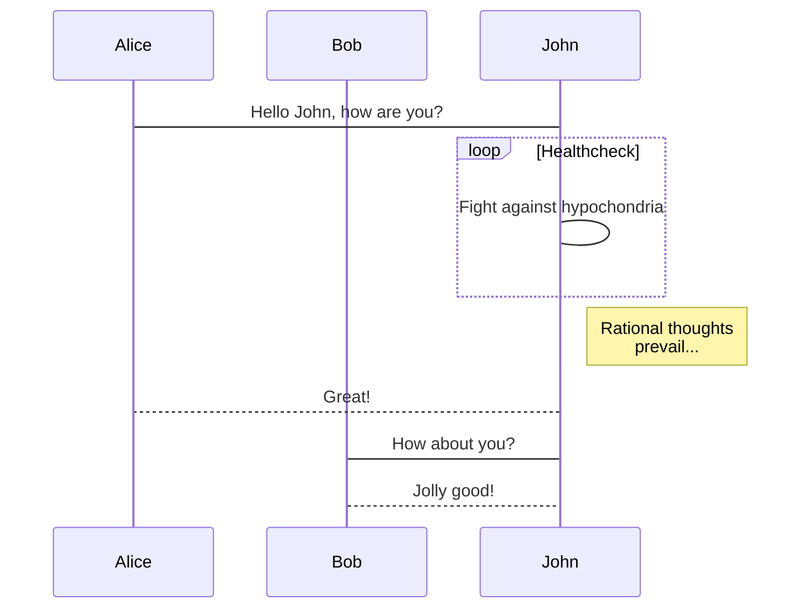
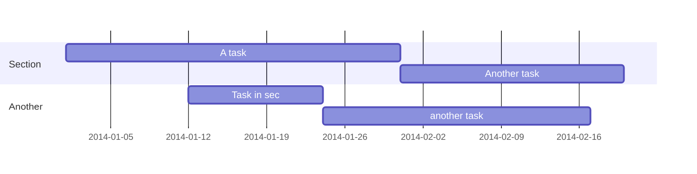

Rich content can be written in Wowchemy using **Markdown**, [**LaTeX math**](https://en.wikibooks.org/wiki/LaTeX/Mathematics), and **Shortcodes**. This article gives an overview of the most common formatting options, including features that are exclusive to Wowchemy.

{}
*Shortcodes* are plugins which are bundled with Wowchemy or inherited from [Hugo](http://gohugo.io/extras/shortcodes/). Additionally, **HTML** may be written in Markdown documents for advanced formatting.
{}



## Sub-headings

After the page title, heading 1, we can format sub-headings in the page body:

```markdown
## Heading 2
### Heading 3
#### Heading 4
```

## Emphasis

### Bold, Italic, Strikethrough

```markdown
Italics with _underscores_.

Bold with **asterisks**.

Combined emphasis with **asterisks and _underscores_**.

Strikethrough with ~~two tildes~~.
```

Italics with _underscores_.

Bold with **asterisks**.

Combined emphasis with **asterisks and _underscores_**.

Strikethrough with ~~two tildes~~.

### Text color

Add the [HTML color](https://www.google.com/search?q=color+picker) attribute in the form `{style="color: red"}` to the line _after_ a Markdown block.

For example, to color a paragraph red:

```Markdown
Red colored text
{style="color: red"}
```

### Blockquote

    > This is a blockquote.

> This is a blockquote.

### Highlight quote

    This is a highlighted quote.

This is a highlighted quote.

## Lists
### Ordered

    1. First item
       1. A sub-item
    2. Another item

1. First item
   1. A sub-item
2. Another item

### Unordered 

    - First item
      - A sub-item
    - Another item

- First item
  - A sub-item
- Another item

### Todo

Todo lists can be written in Wowchemy by using the standard Markdown syntax:

```markdown
- [x] Write math example
  - [x] Write diagram example
- [ ] Do something else
```

renders as

- [x] Write math example
  - [x] Write diagram example
- [ ] Do something else

### Toggle lists

Add a toggle list to a page to reveal text, such as an answer to a question, after a toggle button is clicked.

Useful for FAQs, spoilers, or hiding answers when teaching online courses.

```markdown

You found me!

```

renders as

 You found me! 

## Links

### Link to a page

    [I'm an external link](https://www.google.com)
    [A post]()
    [A publication]()
    [A project]()
    [A relative link from one post to another post]()
    [Scroll down to a page section with heading *Hi*](#hi)

You can also [create a button link in the **page header**]() of any page except Widget Pages (the homepage).

### Link to a file

You can [create a button link to a file in the **page header**]() of any page except Widget Pages (the homepage).

Otherwise, to link to a file, such as a PDF, in the **body** of your content, place the file in your `static/uploads/` folder and then link to it using the following form:

    {}Download my CV{}

The optional `"newtab"` argument for `staticref` will cause the link to be opened in a new tab.

### Cite

To cite a page or publication, you can use the _cite_ shortcode, referencing a folder and page name that you created:

    

where _view_ corresponds to one of the available listing views used throughout Wowchemy:

1. Stream
2. Compact
3. Card
4. Citation - a traditional academic citation, configured by the `citation_style` setting in `params.yaml`

If you don't specify a view, it will default to the _compact_ view.

### Table of Contents

A table of contents can help users navigate long pages.

Paste the `` shortcode wherever you would like a table of contents to appear in your page.

You may also wish to consider using the [_book_ layout]() which displays a built-in table of contents in a right sidebar on large screens. 

When using the _book_ layout, you may still wish to add an in-page table of contents which only appears when the right sidebar is hidden. You can do this with ``.

### Footnotes

    I have more [^1] to say.
    
    [^1]: Footnote example.

I have more [^1] to say.
[^1]: Footnote example.

### Figures

To cross-reference a figure, provide it with an ID, for example: ``.

The figure can now be cross-referenced with a link in the form `[A Figure](#figure-wowchemy)`.

### Tags and Categories

Use `` to provide a list of linked tags or `` to provide a list of linked categories.

### Call-to-Action Buttons

**Create buttons and call-to-actions (CTA)** with the _CTA_ shortcode.

Example CTA button:

```

```

Example CTA button with a link to an alternate action:

```

```

### Mention a user

To mention someone, type `{}` where `username` corresponds to a user account in Wowchemy.

### List child pages

To list child pages, such as to list book sections from a book chapter, use ``.

## Images

### Single image

Images may be added to a page by either placing them in your `assets/media/` media library or in your [page's folder](https://gohugo.io/content-management/page-bundles/), and then referencing them using one of the following notations.

Figures are **themeable** according to light/dark mode and can also be [**cross-referenced**](#links).

A figure from your page's folder or your `assets/media/` media library:

    

For more customizable figures, we can use the built-in Figure shortcode rather than the Markdown figure syntax above.

A numbered figure with a caption:

    

**Using light/dark mode?** Did you know that you can create **dynamically themed light/dark images?**



To **dynamically theme images** according to the user's light or dark theme

  - `` inverts image when browsing in dark mode
  - `` inverts image when browsing in light mode

Alternatively, paste a **themeable inline SVG image** in the form `<svg fill="currentColor">...</svg>` directly into your Markdown.

### Image gallery

**To add an image gallery to a page:**

1. Create a photo album folder in `assets/media/albums/`
   - Album names must be **lowercase** due to a [Hugo bug](https://github.com/gohugoio/hugo/issues/7686) - consider up-voting the bug with a 👍
2. Add images to your album folder
3. Paste `` where you would like the gallery to appear in the page content, changing the album parameter to match the name of your album folder

**How can I change the size or shape of gallery images?**

Simply add `resize_options` when you call the gallery shortcode. This option lets you control the shape/size of gallery images using the standard [Hugo resize options](https://gohugo.io/content-management/image-processing/#resize). For example:

```go

```

**How can I add captions to gallery images?**

Optionally, to add captions for your images, add the following instances to the end of your page's front matter:

```yaml
gallery_item:
- album: <ALBUM FOLDER>
  image: <IMAGE 1 NAME>.jpg
  caption: Write your image 1 caption here
- album: <ALBUM FOLDER>
  image: <IMAGE 2 NAME>.jpg
  caption: Write your image 2 caption here
```

### Inline image

Wowchemy enables you to use a wide range of [inline images (aka icons) from _Font Awesome_ and _Academicons_]() in addition to [emojis](#emojis). There is also an [issue](https://github.com/wowchemy/wowchemy-hugo-themes/issues/1698) open to add support for custom images.

Here are some examples using the _icon_ shortcode to render icons:

```markdown
 Terminal  
 Python  
 R
```

renders as

 Terminal  
 Python  
 R

Optionally, left and right padding can be added to an icon using the `padding_left="3"` and `padding_right="3"` options, respectively.

### Emojis

An emoji can be inserted using either an emoji keyboard or by typing the name of the emoji.

Don't have an emoji keyboard?

Copy and paste emoji names from the [Emoji cheat sheet](http://www.webpagefx.com/tools/emoji-cheat-sheet/). The following serves as an example, but remember to remove the added spaces between each emoji name and surrounding colons:

    I : heart : Wowchemy : smile :

I :heart: Wowchemy :smile:

## Twitter

### Embed a feed

[Design your timeline on Twitter](https://help.twitter.com/en/using-twitter/embed-twitter-feed) and paste it into a Markdown page.

### Embed a single tweet

To include a single tweet, pass the tweet’s user (case-insensitive) and ID from the URL as parameters to the shortcode:

    

## Callouts

Wowchemy supports a Markdown extension for callouts, also referred to as _alerts_ or _asides_.

Callouts are a useful feature to **draw attention to important or related content** such as notes, hints, or warnings in your articles. They are especially handy when writing educational tutorial-style articles or documentation.

A callout can be created by using the _Callout_ shortcode below.

Wowchemy comes built-in with a few different styles of callouts.

The paragraph will render as a callout with the default *note* style:

    {}
    A Markdown callout is useful for displaying notices, hints, or definitions to your readers.
    {}

This will display the following *note* block:

{}
A Markdown callout is useful for displaying notices, hints, or definitions to your readers.
{}

Alternatively, a warning can be displayed to the reader using the _warning_ option:

    {}
    Here's some important information...
    {}

This will display the following *warning* notice to the reader:

{}
Here's some important information...
{}

## Audio

You can add a podcast or music to a page by placing the MP3 file in the page's folder and then referencing the audio file using the _audio_ shortcode:

    

## Videos

The following kinds of video may be added to a page.

**Local video file**

Videos may be added to a page by either placing them in your `assets/media/` media library or in your [page's folder](https://gohugo.io/content-management/page-bundles/), and then referencing them using one of the following notations.

A video from your page folder or your `assets/media/` media library:

    

Wowchemy will search for the video in your page folder and your media library at `assets/media/`.
    
**External video file**

    

If you don't want video controls, remove the `controls` parameter and the video will autoplay with looping (great for memes!).

Note that browsers will block autoplay if the video contains sound.

**Youtube**:

    

**Vimeo**:

    

## Charts

Wowchemy supports the popular [Plotly](https://plot.ly/) chart format.

Save your Plotly JSON in your page folder, for example `chart.json`, and then add the `` shortcode where you would like the chart to appear.

Demo:



You might also find the [Plotly JSON Editor](http://plotly-json-editor.getforge.io/) useful.

## Mindmaps

Wowchemy supports a Markdown extension for mindmaps.

Simply insert a Markdown `markmap` code block and optionally set the height of the mindmap as shown in the first example below.

A simple mindmap defined as a Markdown list:

<div class="highlight">
<pre class="chroma">
<code>
```markmap {height="200px"}
- Hugo Modules
  - wowchemy
  - wowchemy-plugins-netlify
  - wowchemy-plugins-netlify-cms
  - wowchemy-plugins-reveal
```
</code>
</pre>
</div>

renders as

```markmap {height="200px"}
- Hugo Modules
  - wowchemy
  - wowchemy-plugins-netlify
  - wowchemy-plugins-netlify-cms
  - wowchemy-plugins-reveal
```

A more advanced mindmap with formatting, code blocks, and math:

<div class="highlight">
<pre class="chroma">
<code>
```markmap
- Mindmaps
  - Links
    - [Wowchemy Docs](https://wowchemy.com/docs/)
    - [Discord Community](https://discord.gg/z8wNYzb)
    - [GitHub](https://github.com/wowchemy/wowchemy-hugo-themes)
  - Features
    - Markdown formatting
    - **inline** ~~text~~ *styles*
    - multiline
      text
    - `inline code`
    -
      ```js
      console.log('hello');
      console.log('code block');
      ```
    - Math: $x = {-b \pm \sqrt{b^2-4ac} \over 2a}$
```
</code>
</pre>
</div>

renders as

```markmap
- Mindmaps
  - Links
    - [Wowchemy Docs](https://wowchemy.com/docs/)
    - [Discord Community](https://discord.gg/z8wNYzb)
    - [GitHub](https://github.com/wowchemy/wowchemy-hugo-themes)
  - Features
    - Markdown formatting
    - **inline** ~~text~~ *styles*
    - multiline
      text
    - `inline code`
    -
      ```js
      console.log('hello');
      console.log('code block');
      ```
    - Math: $x = {-b \pm \sqrt{b^2-4ac} \over 2a}$
```

## Embed Documents

The following kinds of document may be embedded into a page.

To embed **Google Documents** (e.g. slide deck), click *File > Publish to web > Embed* in Google Docs and copy the URL within the displayed `src="..."` attribute. Then paste the URL in the form:

    

## Diagrams

Wowchemy supports the [Mermaid](https://mermaidjs.github.io) Markdown extension for diagrams. Simply draw your diagram within a *mermaid* code block and it will be rendered when your page is published. Check out the Mermaid documentation and the [Mermaid editor](https://mermaid.live/) for more examples in addition to those below:

An example **flowchart**:

    ```mermaid
    graph TD;
      A-->B;
      A-->C;
      B-->D;
      C-->D;
    ```

renders as


An example **sequence diagram**:

    ```mermaid
    sequenceDiagram
      participant Alice
      participant Bob
      Alice->John: Hello John, how are you?
      loop Healthcheck
          John->John: Fight against hypochondria
      end
      Note right of John: Rational thoughts <br/>prevail...
      John-->Alice: Great!
      John->Bob: How about you?
      Bob-->John: Jolly good!
    ```

renders as



An example **Gantt diagram**:

    ```mermaid
    gantt
      dateFormat  YYYY-MM-DD
      section Section
      A task           :a1, 2014-01-01, 30d
      Another task     :after a1  , 20d
      section Another
      Task in sec      :2014-01-12  , 12d
      another task      : 24d
    ```

renders as



### Advanced diagrams

More advanced diagrams can be created in the open source [draw.io](https://draw.io) editor. The editor has support for almost any type of diagram, from simple to complex. A diagram can be easily embedded in Wowchemy by choosing **File > Embed > SVG** in the [draw.io](https://draw.io) editor and pasting the generated code into your page.

Alternatively, a diagram can be exported as an [image](#images) from any drawing software, or a [document/slide](#embed-documents) containing a diagram can be embedded.

## Code highlighting

Pass the *language* of the code, such as `python`, as a parameter after three backticks:

    ```python
    # Example of code highlighting
    input_string_var = input("Enter some data: ")
    print("You entered: {}".format(input_string_var))
    ```
Result:

```python
# Example of code highlighting
input_string_var = input("Enter some data: ")
print("You entered: {}".format(input_string_var))
```

You can also [customize the highlighter theme]().

## Jupyter Notebook

[**View the guide to blogging with Jupyter Notebooks**]().

## GitHub gist

    

## Math

Wowchemy supports a Markdown extension for $\LaTeX$ math. You can enable this feature by toggling the `math` option in your `config/_default/params.yaml` file.

To render *inline* or *block* math, wrap your LaTeX math with `$...$` or `$$...$$`, respectively. (We wrap the LaTeX math in the Wowchemy _math_ shortcode to prevent Hugo rendering our math as Markdown. The _math_ shortcode is new in v5.5.)

Example **math block**:

```latex

$$
\gamma_{n} = \frac{ \left | \left (\mathbf x_{n} - \mathbf x_{n-1} \right )^T \left [\nabla F (\mathbf x_{n}) - \nabla F (\mathbf x_{n-1}) \right ] \right |}{\left \|\nabla F(\mathbf{x}_{n}) - \nabla F(\mathbf{x}_{n-1}) \right \|^2}
$$

```

renders as


$$\gamma_{n} = \frac{ \left | \left (\mathbf x_{n} - \mathbf x_{n-1} \right )^T \left [\nabla F (\mathbf x_{n}) - \nabla F (\mathbf x_{n-1}) \right ] \right |}{\left \|\nabla F(\mathbf{x}_{n}) - \nabla F(\mathbf{x}_{n-1}) \right \|^2}$$


Example **inline math** `$\nabla F(\mathbf{x}_{n})$` renders as $\nabla F(\mathbf{x}_{n})$.

Example **multi-line math** using the math linebreak (`\\`):

```latex

$$f(k;p_{0}^{*}) = \begin{cases}p_{0}^{*} & \text{if }k=1, \\
1-p_{0}^{*} & \text{if }k=0.\end{cases}$$

```

renders as


$$f(k;p_{0}^{*}) = \begin{cases}p_{0}^{*} & \text{if }k=1, \\
1-p_{0}^{*} & \text{if }k=0.\end{cases}$$


**Math in front matter**

Math is primarily intended for use within the page body, but can also be added to page front matter variables such as a publication abstract with some additional checks.

As Hugo and Wowchemy can attempt to parse YAML, Markdown, and LaTeX content in the front matter, Markdown special characters need to be escaped in any math within the front matter fields by using a backslash to prevent the math being parsed as Markdown. The following tips may help:

- escape each LaTeX backslash (`\`) with an extra backslash, yielding `\\`
- escape each LaTeX underscore (`_`) with two backslashes, yielding `\\_`

Hence, `abstract: "${O(d_{\max})}$"` becomes `abstract: "${O(d\\_{\\max})}$"`.

## Subscripts & superscripts

Subscripts and superscripts can be written direct from a (unicode) keyboard or [pasted from a reference](https://en.wikipedia.org/wiki/Unicode_subscripts_and_superscripts).

Alternatively, you can enable `math` in `params.yaml` and use the Latex notation, for example `$^2$`.

## Tables

### Markdown Table

For quick, simple tables, use the [Markdown table generator](https://www.tablesgenerator.com/markdown_tables) and paste the resulting Markdown into your page.

### CSV Table

For larger tables, save your spreadsheet as a CSV file in your page's folder and then render it by adding the _Table_ shortcode to your page: 

```go

```

### Google Sheets

See the [Embed Documents](#embed-documents) section.
