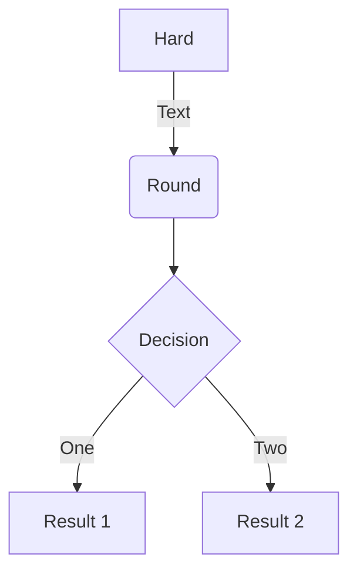
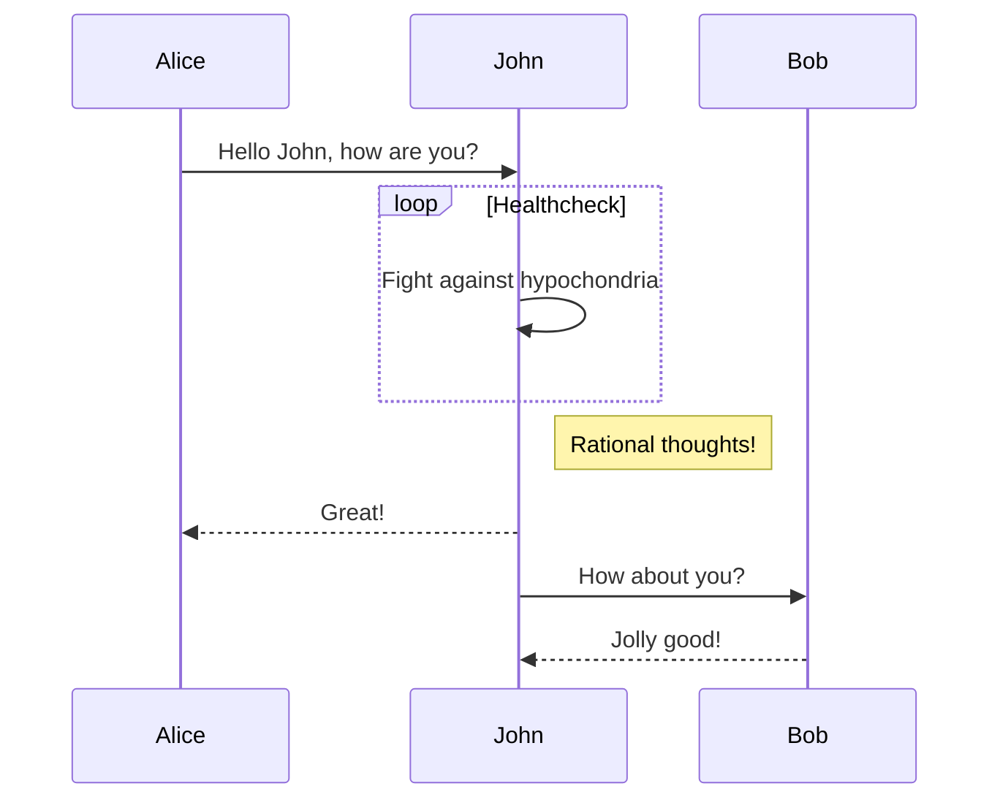
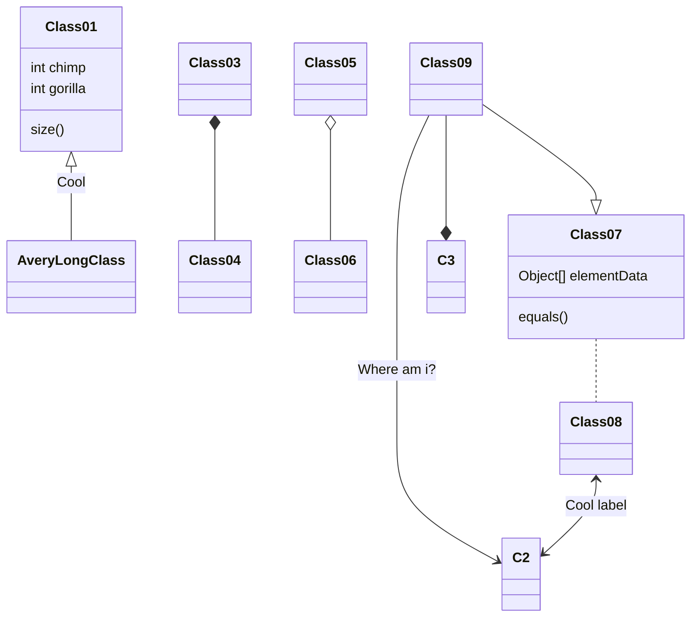
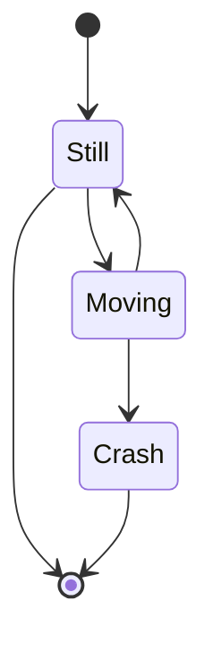

Hugo Blox is designed to give technical content creators a seamless experience. You can focus on the content and Hugo Blox handles the rest.

Use popular tools such as Plotly, Mermaid, and data frames.

## Embed Rich Content

HuggingFace Model



HuggingFace Dataset



GitHub Repository



Custom embed with manual data



### Custom Images

Embed beautiful images from any source with Hugo image processing (Unsplash, custom URLs, etc.):



You can also add images to any platform embed:



## Charts

Hugo Blox supports the popular [Plotly](https://plot.ly/) format for interactive data visualizations. With Plotly, you can design almost any kind of visualization you can imagine!

Save your Plotly JSON in your page folder, for example `line-chart.json`, and then add the `` shortcode where you would like the chart to appear.

Demo:



You might also find the [Plotly JSON Editor](http://plotly-json-editor.getforge.io/) useful.

## Diagrams

Hugo Blox supports the _Mermaid_ Markdown extension for diagrams.

An example **flowchart**:

    ```mermaid
    graph TD
    A[Hard] -->|Text| B(Round)
    B --> C{Decision}
    C -->|One| D[Result 1]
    C -->|Two| E[Result 2]
    ```

renders as



An example **sequence diagram**:

    ```mermaid
    sequenceDiagram
    Alice->>John: Hello John, how are you?
    loop Healthcheck
        John->>John: Fight against hypochondria
    end
    Note right of John: Rational thoughts!
    John-->>Alice: Great!
    John->>Bob: How about you?
    Bob-->>John: Jolly good!
    ```

renders as



An example **class diagram**:

    ```mermaid
    classDiagram
    Class01 <|-- AveryLongClass : Cool
    Class03 *-- Class04
    Class05 o-- Class06
    Class07 .. Class08
    Class09 --> C2 : Where am i?
    Class09 --* C3
    Class09 --|> Class07
    Class07 : equals()
    Class07 : Object[] elementData
    Class01 : size()
    Class01 : int chimp
    Class01 : int gorilla
    Class08 <--> C2: Cool label
    ```

renders as



An example **state diagram**:

    ```mermaid
    stateDiagram
    [*] --> Still
    Still --> [*]
    Still --> Moving
    Moving --> Still
    Moving --> Crash
    Crash --> [*]
    ```

renders as



## Data Frames

Save your spreadsheet as a CSV file in your page's folder and then render it by adding the _Table_ shortcode to your page:

```go

```

renders as



## Interactive Buttons

Add engaging call-to-action buttons to your data visualization posts:

### Basic Buttons

Contact Us

&nbsp;

Learn Plotly

```go-html-template
Contact Us

Learn Plotly
```

### Styled Buttons for Data Actions

View Dashboard

&nbsp;

Download Data

&nbsp;

View Source Code

```go-html-template
View Dashboard

Download Data

View Source Code
```

### Multiple Aligned Buttons

Try Jupyter

&nbsp;

Open in Colab

```go-html-template
Try Jupyter

Open in Colab
```

## Did you find this page helpful? Consider sharing it 🙌
