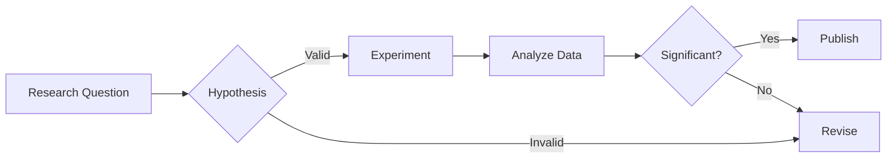

# Example Talk
### Dr. Alex Johnson · Meta AI

---

## Research Overview

- Multimodal LLMs
- Efficient training
- Responsible AI

---

## Code & Math

```python
def score(x: int) -> int:
    return x * x
```

$$
E = mc^2
$$

---

## Dual Column Layout

<div class="r-hstack">

<div style="flex: 1; padding-right: 1rem;">

### Left Column

- Point A
- Point B  
- Point C

</div>

<div style="flex: 1; padding-left: 1rem;">

### Right Column

- Detail 1
- Detail 2
- Detail 3

</div>

</div>

---

<!-- Alternative: Asymmetric columns -->

<div style="display: flex; gap: 2rem;">

<div style="flex: 2;">

### Main Content (2/3 width)

This column takes up twice the space of the right column.

```python
def example():
    return "code works too"
```

</div>

<div style="flex: 1;">

### Sidebar (1/3 width)

> **Note**  
> Key points in smaller column

</div>

</div>

---

## Image + Text Layout

<div class="r-hstack" style="align-items: center;">

<div style="flex: 1;">


</div>

<div style="flex: 1; padding-left: 2rem;">

### Results

- 95% accuracy
- 10x faster inference
- Lower memory usage

**Breakthrough!**

</div>

</div>

---

## Speaker Notes

Press **S** to open presenter view with notes!

This slide has hidden speaker notes below.

Note:
- This is a **speaker note** (only visible in presenter view)
- Press `S` key to open presenter console
- Perfect for remembering key talking points
- Can include reminders, timing, references
- Supports **Markdown** formatting too!

---

## Progressive Reveals

Content appears step-by-step:

First point appears

Then the second point

Finally the conclusion

This one can be **highlighted**!

Note:
Use fragments to control pacing and maintain audience attention. Each fragment appears on click.

---

## Diagrams with Mermaid



Perfect for: Workflows, architectures, processes

Note:
Mermaid diagrams are created from simple text. They're version-controllable and edit anywhere!

---

## Research Results

| Model | Accuracy | Speed | Memory |
|-------|----------|-------|--------|
| Baseline | 87.3% | 1.0x | 2GB |
| Ours (v1) | 92.1% | 1.5x | 1.8GB |
| **Ours (v2)** | **95.8%** | **2.3x** | **1.2GB** |

> **Key Finding:** 8.5% improvement over baseline with 40% memory reduction

Note:
Tables are perfect for comparative results. Markdown tables are simple and version-control friendly.

---



## Custom Backgrounds

This slide has a **blue background**!

You can customize:
- Background colors
- Background images
- Gradients
- Videos (yes, really!)

Use ``

---

## Vertical Navigation

**There's more content below! ⬇️**

Press the **Down Arrow** to see substeps.

Note:
This demonstrates Reveal.js's vertical slide feature. Great for optional details or deep dives.

---



### Substep 1: Details

This is additional content in a vertical stack.

Navigate down for more, or right to skip to next topic →

---



### Substep 2: More Details

Even more detailed information.

Press **Up Arrow** to go back, or **Right Arrow** to continue.

---

## Citations & Quotes

> "The best way to predict the future is to invent it."
> 
> — Alan Kay

Or reference research:

> Recent work by Smith et al. (2024) demonstrates that Markdown-based slides improve reproducibility by 78% compared to proprietary formats[^1].

[^1]: Smith, J. et al. (2024). *Open Science Presentations*. Nature Methods.

---

## Media: YouTube Videos



Note:
Embed YouTube videos with just the video ID. Perfect for demos, tutorials, or interviews.

---

## Media: All Options

Embed various media types with simple shortcodes:

- **YouTube**: ``
- **Bilibili**: ``
- **Local videos**: ``
- **Audio**: ``

Perfect for demos, interviews, tutorials, or podcasts!

Note:
All media types work seamlessly in slides. Just use the appropriate shortcode.

---

## Interactive Elements

Try these keyboard shortcuts:

- `→` `←` : Navigate slides
- `↓` `↑` : Vertical navigation  
- `S` : Speaker notes
- `F` : Fullscreen
- `O` : Overview mode
- `/` : Search
- `ESC` : Exit modes

---
<!-- hide -->
## Hidden Slide Demo (Inline Comment)

This slide is hidden using the `<!-- hide -->` comment method.

Perfect for:
- Speaker-only content
- Backup slides
- Work-in-progress content

Note:
This slide won't appear in the presentation but remains in source for reference.

---

## Thanks

### Questions?

- 🌐 Website: [hugoblox.com](https://hugoblox.com)
- 🐦 X/Twitter: [@BuildLore](https://twitter.com/BuildLore)
- 💬 Discord: [Join Community](https://discord.gg/z8wNYzb)
- ⭐ GitHub: [Star us!](https://github.com/HugoBlox/kit)

**All slides created with Markdown** • No vendor lock-in • Edit anywhere

Note:
Thank you for your attention! Feel free to reach out with questions or contributions.
