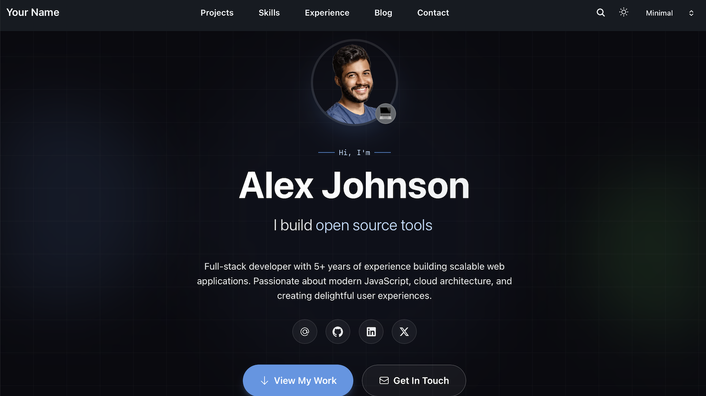

# [Developer Portfolio](https://hugoblox.com/templates/dev-portfolio/start?utm_source=github&utm_medium=readme)

[](https://hugoblox.com/templates/dev-portfolio/start?utm_source=github&utm_medium=readme)

<h1 align="center">The Dev Portfolio That Gets You Hired</h1>

<p align="center">
  <strong>Built for uni students, STEM grads, and software engineers.</strong><br/>
  Showcase real projects, ship a clean blog, and stand out with a modern dark-first design — without a fragile “black box” React app.
</p>

<p align="center">
  <a href="https://hugoblox.com/templates/dev-portfolio/start?utm_source=github&utm_medium=readme"><b>🚀 Deploy in 60s (Free)</b></a>
  &nbsp;•&nbsp;
  <a href="https://hugoblox.com/templates/?open=dev-portfolio&loading=true&utm_source=github&utm_medium=readme">Live Demo</a>
  &nbsp;•&nbsp;
  <a href="https://docs.hugoblox.com/guides/studio/">Lore Studio (Visual Editor)</a>
</p>


<p align="center">
  <b>▶︎ Watch 12s Preview</b>
</p>

https://github.com/user-attachments/assets/a6b676c0-1c10-4734-a55f-68c6f72d1612

<p align="center">
  <a href="https://discord.gg/z8wNYzb"></a>
  <a href="https://github.com/HugoBlox/kit"></a>
  <a href="https://x.com/LoreLabs_"></a>
</p>

---

## Why this template?

Most portfolios look the same — and most “quick” site builders produce slow sites you can’t maintain.

- **⚡ Fast by default**: Hugo + Tailwind 4 + Hugo Modules → great Lighthouse scores without JS bloat.
- **🧠 AI-ready content**: Your projects and posts live in clean Markdown/YAML — readable by humans and LLMs.
- **🎯 Job-hunting optimized**: Projects, tech stack, experience timeline, and a blog layout that looks credible.
- **🌙 Dark-first (but light-mode supported)**: Looks premium in dark mode, still works perfectly in light mode.
- **🧩 Block-based**: Reorder/replace sections without rewriting templates.

---

## Who it’s for

- **Students & grads** applying to internships / MSc / PhD / junior roles
- **STEM professionals** (research, data, ML, bio, engineering) showcasing projects and writing
- **Software engineers** building a portfolio that feels modern in 2026

---

## What you get (Free)

- **Developer hero** with modern gradients + optional typewriter
- **Filterable portfolio** (tags + smooth transitions)
- **Tech stack** grid with icons
- **Experience + education timeline**
- **Blog section** (cards + featured images)
- **Contact section** with social links + copy email

---

## Get started (recommended)

### Option 1 — Online deployer (fastest)

Deploy this template in ~60 seconds:

- [Deploy in browser →](https://hugoblox.com/templates/dev-portfolio/start?utm_source=github&utm_medium=readme)

### Option 2 — Lore Studio (visual editor in VS Code)

- [Studio guide →](https://docs.hugoblox.com/guides/studio/?utm_source=github&utm_medium=readme)
- [Studio AI automation plans (Free/Plus/Pro) →](https://hugoblox.com/pricing/?utm_source=github&utm_medium=readme)

### Option 3 — HugoBlox CLI (developer workflow)

Install:

```bash
npm install -g hugoblox@latest
```

Create a site:

```bash
hugoblox create site --template dev-portfolio
```

[CLI docs →](https://docs.hugoblox.com/start/cli/?utm_source=github&utm_medium=readme)

---

## Customize in 10 minutes

- **Your profile**: `data/authors/me.yaml`
- **Homepage sections**: `content/_index.md`
- **Projects**: `content/projects/<project>/index.md`
- **Blog posts**: `content/blog/<post>/index.md`
- **Theme + identity**: `config/_default/params.yaml`

---

## Want the Pro version? 💎

If you want a version that feels meaningfully more premium (and helps fund open source + research):

- [Premium template →](https://hugoblox.com/templates/dev-portfolio-pro/start?utm_source=github&utm_medium=readme)
- [HugoBlox Pro / Studio →](https://hugoblox.com/pricing?utm_source=github&utm_medium=readme)

---

## Community & support

- **Docs**: [docs.hugoblox.com →](https://docs.hugoblox.com/?utm_source=github&utm_medium=readme)
- **Discord**: [Join Discord →](https://discord.gg/z8wNYzb)
- **Issues**: [Open an issue →](https://github.com/HugoBlox/kit/issues)

---

MIT © 2016–Present [George Cushen](https://neuralgeo.com/?utm_source=github&utm_medium=readme)
