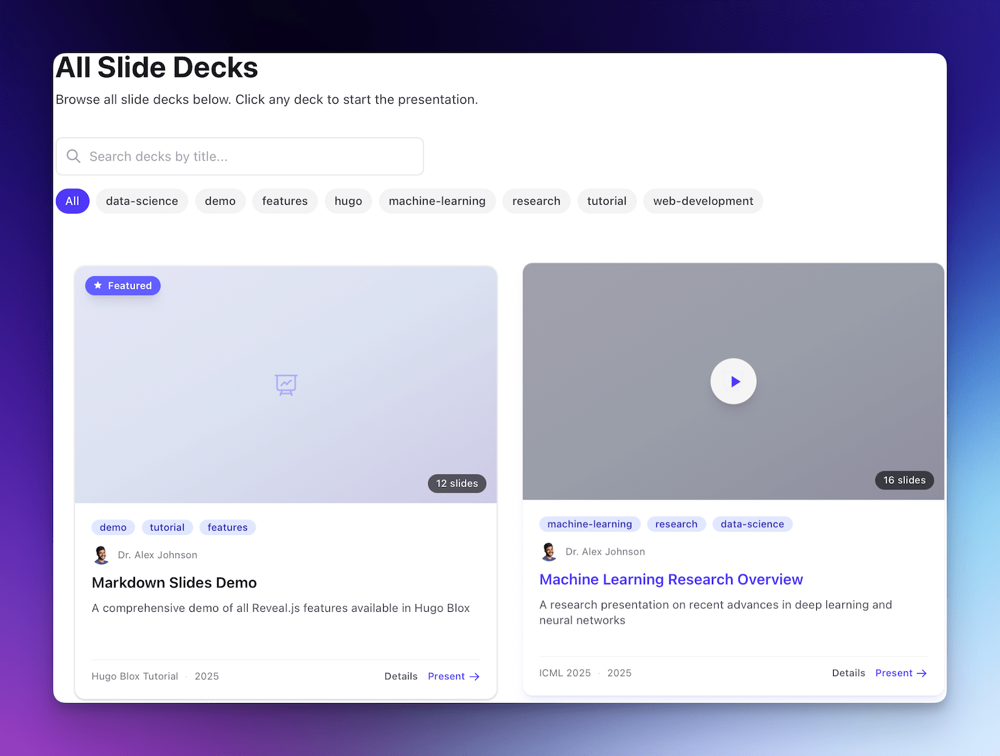

# [Markdown Slides](https://hugoblox.com/templates/markdown-slides/start?utm_source=github&utm_medium=readme)

[](https://hugoblox.com/templates/markdown-slides/start?utm_source=github&utm_medium=readme)

<h1 align="center">The Presentation Framework for Researchers</h1>

<p align="center">
  <strong>Stop wrestling with PowerPoint.</strong><br/>
  Write slides in Markdown, version control your talks, and present code & math beautifully.
</p>

<p align="center">
  <a href="https://hugoblox.com/templates/markdown-slides/start?utm_source=github&utm_medium=readme"><b>🚀 Deploy in 60s (Free)</b></a>
  &nbsp;•&nbsp;
  <a href="https://hugoblox.com/templates/?open=markdown-slides&loading=true&utm_source=github&utm_medium=readme">Live Demo</a>
  &nbsp;•&nbsp;
  <a href="https://docs.hugoblox.com/guides/studio/">HugoBlox Studio (Visual Editor)</a>
</p>

<p align="center">
  <b>▶︎ Watch Preview</b>
</p>

https://github.com/user-attachments/assets/5a93788a-65d7-4a56-8355-4a2098a5f89b

<p align="center">
  <a href="https://discord.gg/z8wNYzb"></a>
  <a href="https://github.com/HugoBlox/kit"></a>
  <a href="https://x.com/LoreLabs_"></a>
</p>

---

## Why this template?

Traditional slide software (PowerPoint, Keynote) locks your content in binary files, breaks code formatting, and makes version control a nightmare.

- **📝 Markdown-first**: Write slides like you write papers. Focus on content, not pixel-perfect alignment.
- **⚗️ Research-ready**: Native support for LaTeX math ($E=mc^2$), citations, and rich metadata (venue, DOI, authors).
- **💻 Code-native**: Beautiful syntax highlighting for 100+ languages without screenshots.
- **🎓 Deck Landing Pages**: Every presentation gets a dedicated searchable landing page with abstract and download links.
- **🚀 Present Anywhere**: Browser-based presenter mode (Reveal.js) with speaker notes, timer, and offline support.

---

## Who it’s for

- **Academics** presenting at conferences (share a URL, not a USB drive).
- **Data Scientists** explaining complex analyses with real code snippets.
- **Lecturers** creating course materials that students can actually search, read, and fork.
- **Developers** who prefer their IDE over a GUI presentation tool.

---

## What you get (Free)

- **Professional Presenter Mode**: Speaker notes, timer, and next-slide preview.
- **Rich Metadata**: Associate events, co-authors, and related links with each deck.
- **PDF Export**: One-click printable version for handouts.
- **Mermaid Diagrams**: Draw flowcharts and sequence diagrams in text.
- **Theming**: Light, dark, and custom themes included.
- **Mobile Optimized**: Responsive gallery and slide viewer.

---

## Get started (recommended)

### Option 1 — Online deployer (fastest)

Deploy this template in ~60 seconds:

- [Deploy in browser →](https://hugoblox.com/templates/markdown-slides/start?utm_source=github&utm_medium=readme)

### Option 2 — HugoBlox Studio (visual editor in VS Code)

- [Studio guide →](https://docs.hugoblox.com/guides/studio/?utm_source=github&utm_medium=readme)
- [Studio AI automation plans (Free/Plus/Pro) →](https://hugoblox.com/pricing/?utm_source=github&utm_medium=readme)

### Option 3 — HugoBlox CLI (developer workflow)

Install:

```bash
npm install -g hugoblox@latest
```

Create a site:

```bash
hugoblox create site --template markdown-slides
```

[CLI docs →](https://docs.hugoblox.com/start/cli/?utm_source=github&utm_medium=readme)

---

## Customize in 10 minutes

- **Create a deck**: `content/slides/my-talk/index.md`
- **Slide syntax**: Use `---` to separate slides.
- **Speaker notes**: Use `Note:` at the end of a slide.
- **Theme**: Set `slides.theme: black` (or white, league, night, etc.) in frontmatter.
- **Site Identity**: `config/_default/params.yaml`

---

## Want the Pro version? 💎

If you want a version that feels meaningfully more premium (and helps fund open source + research):

- [Premium templates →](https://hugoblox.com/templates/?utm_source=github&utm_medium=readme)
- [HugoBlox Pro / Studio →](https://hugoblox.com/pricing?utm_source=github&utm_medium=readme)

---

## Community & support

- **Docs**: [docs.hugoblox.com →](https://docs.hugoblox.com/?utm_source=github&utm_medium=readme)
- **Discord**: [Join Discord →](https://discord.gg/z8wNYzb)
- **Issues**: [Open an issue →](https://github.com/HugoBlox/kit/issues)

---

MIT © 2016–Present [George Cushen](https://neuralgeo.com/?utm_source=github&utm_medium=readme)
