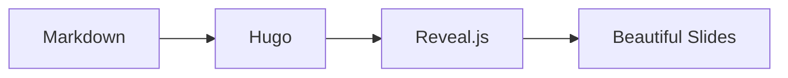

# Markdown Slides

### Write in Markdown. Present Anywhere.

---

## What You Can Do

- Write slides in **pure Markdown**
- Include **code**, **math**, and **diagrams**
- Add **speaker notes** for presenter view
- Use **progressive reveals** for storytelling
- Customize **themes** and **transitions**

---

## Code Highlighting

```python
def fibonacci(n: int) -> int:
    if n <= 1:
        return n
    return fibonacci(n-1) + fibonacci(n-2)
    
# Calculate the 10th Fibonacci number
print(fibonacci(10))  # Output: 55
```

---

## Mathematical Equations

Einstein's famous equation:

$$E = mc^2$$

The quadratic formula:

$$x = \frac{-b \pm \sqrt{b^2-4ac}}{2a}$$

---

## Mermaid Diagrams



---

## Progressive Reveals

Build your narrative step by step:

First, introduce the concept

Then, add supporting details

Finally, deliver the conclusion

---

## Speaker Notes

Press **S** to open presenter view!

Note:
- These notes are only visible in presenter mode
- Perfect for talking points and reminders
- Supports **Markdown** formatting
- Add timing cues and references here

---

## Dual Column Layout

<div class="r-hstack">

<div style="flex: 1; padding-right: 1rem;">

### Benefits

- Open source
- Version control
- No vendor lock-in
- Works offline

</div>

<div style="flex: 1; padding-left: 1rem;">

### Use Cases

- Tech talks
- Academic papers
- Team updates
- Training sessions

</div>

</div>

---



## Custom Backgrounds

Slides can have **custom colors** or images.

Use ``

---

## Keyboard Shortcuts

| Key | Action |
|-----|--------|
| `→` / `←` | Navigate slides |
| `S` | Speaker notes |
| `F` | Fullscreen |
| `O` | Overview mode |
| `ESC` | Exit modes |

---

## Get Started

1. Create a file in `content/slides/`
2. Add front matter with `type: slides`
3. Write your content in Markdown
4. Separate slides with `---`

---

## Thank You!

**Questions?**

- GitHub: [HugoBlox/kit](https://github.com/HugoBlox/kit)
- Docs: [docs.hugoblox.com](https://docs.hugoblox.com)

*Built with Markdown Slides*
