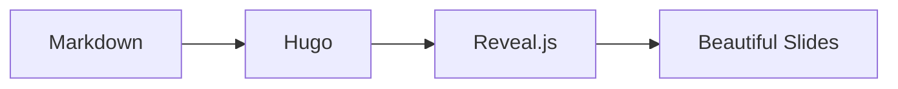

<!-- no-branding -->
# Markdown Slides

### Write in Markdown. Present Anywhere.

---

## What You Can Do

- Write slides in **pure Markdown**
- Include **code**, **math**, and **diagrams**
- Add **speaker notes** for presenter view
- Use **progressive reveals** for storytelling
- Customize **themes** and **transitions**

---

## Code Highlighting

```python
def fibonacci(n: int) -> int:
    if n <= 1:
        return n
    return fibonacci(n-1) + fibonacci(n-2)
    
# Calculate the 10th Fibonacci number
print(fibonacci(10))  # Output: 55
```

---

## Mathematical Equations

Einstein's famous equation:

$$E = mc^2$$

The quadratic formula:

$$x = \frac{-b \pm \sqrt{b^2-4ac}}{2a}$$

---

## Mermaid Diagrams



---

## Progressive Reveals

Build your narrative step by step:

First, introduce the concept

Then, add supporting details

Finally, deliver the conclusion

---

## Speaker Notes

Press **S** to open presenter view!

Note:
- These notes are only visible in presenter mode
- Perfect for talking points and reminders
- Supports **Markdown** formatting
- Add timing cues and references here

---

## Dual Column Layout

<div class="r-hstack">

<div style="flex: 1; padding-right: 1rem;">

### Benefits

- Open source
- Version control
- No vendor lock-in
- Works offline

</div>

<div style="flex: 1; padding-left: 1rem;">

### Use Cases

- Tech talks
- Academic papers
- Team updates
- Training sessions

</div>

</div>

---



## Custom Backgrounds

Slides can have **custom colors** or images.

Use ``

---

## Keyboard Shortcuts

| Key | Action |
|-----|--------|
| `→` / `←` | Navigate slides |
| `S` | Speaker notes |
| `F` | Fullscreen |
| `O` | Overview mode |
| `ESC` | Exit modes |

---

## Get Started

1. Create a file in `content/slides/`
2. Add front matter with `type: slides`
3. Write your content in Markdown
4. Separate slides with `---`

---

## Thank You!

**Questions?**

- GitHub: [HugoBlox/kit](https://github.com/HugoBlox/kit)
- Docs: [docs.hugoblox.com](https://docs.hugoblox.com)

*Built with Markdown Slides*

---

## 🎨 Branding Your Slides

Add your identity to every slide with simple configuration!

**What you can add:**

| Element | Position Options |
|---------|-----------------|
| Logo | top-left, top-right, bottom-left, bottom-right |
| Title | Same as above |
| Author | Same as above |
| Footer Text | Same + bottom-center |

Edit the `branding:` section in your slide's front matter (top of file).

---

## 📁 Adding Your Logo

1. Place your logo in `assets/media/` folder
2. Use SVG format for best results (auto-adapts to any theme!)
3. Add to front matter:

```yaml
branding:
  logo:
    filename: "your-logo.svg"  # Must be in assets/media/
    position: "top-right"
    width: "60px"
```

**Tip:** SVGs with `fill="currentColor"` automatically match theme colors!

---

## 📝 Title & Author Overlays

Show presentation title and/or author on every slide:

```yaml
branding:
  title:
    show: true
    position: "bottom-left"
    text: "Short Title"  # Optional: override long page title
  
  author:
    show: true
    position: "bottom-right"
```

Author is auto-detected from page front matter (`author:` or `authors:`).

---

## 📄 Footer Text

Add copyright, conference name, or any persistent text:

```yaml
branding:
  footer:
    text: "© 2024 Your Name · ICML 2024"
    position: "bottom-center"
```

**Tip:** Supports Markdown! Use `[Link](url)` for clickable links.

---

<!-- no-branding -->

## 🔇 Hiding Branding Per-Slide

Sometimes you want a clean slide (title slides, full-screen images).

Add this comment at the **start** of your slide content:

```markdown
<!-- no-branding -->
## My Clean Slide

Content here...
```

☝️ **This slide uses `<!-- no-branding -->`** — notice no logo or overlays!

---

<!-- no-header -->

## 🔇 Selective Hiding

Hide just the header (logo + title):

```markdown
<!-- no-header -->
```

Or just the footer (author + footer text):

```markdown
<!-- no-footer -->
```

☝️ **This slide uses `<!-- no-header -->`** — footer still visible below!

---

<!-- no-footer -->

## ✅ Quick Reference

| Comment | Hides |
|---------|-------|
| `<!-- no-branding -->` | Everything (logo, title, author, footer) |
| `<!-- no-header -->` | Logo + Title overlay |
| `<!-- no-footer -->` | Author + Footer text |

☝️ **This slide uses `<!-- no-footer -->`** — logo still visible above!

