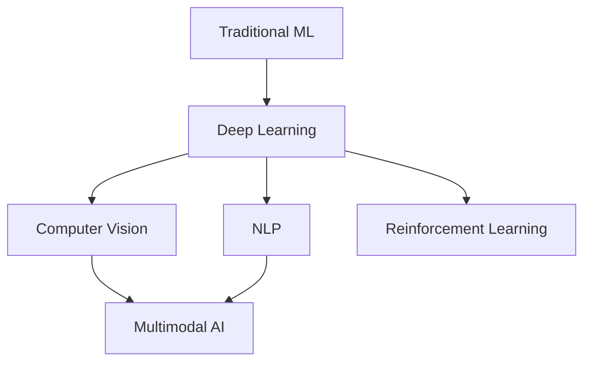
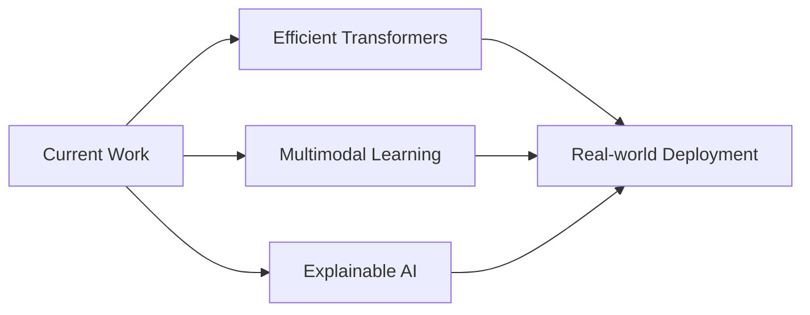

# Machine Learning
## Research Overview 2025

Dr. Example Researcher

---

## Agenda

1. Background & Motivation
2. Neural Network Fundamentals
3. Transformer Architecture
4. Experimental Results
5. Future Directions

---

## The Deep Learning Revolution



---

## Neural Network Basics

A neuron computes:

$$y = f\left(\sum_{i=1}^{n} w_i x_i + b\right)$$

Where:
- $x_i$ = inputs
- $w_i$ = weights  
- $b$ = bias
- $f$ = activation function

---

## Activation Functions

**ReLU (Rectified Linear Unit):**

$$f(x) = \max(0, x)$$

**Sigmoid:**

$$\sigma(x) = \frac{1}{1 + e^{-x}}$$

**Softmax:**

$$\text{softmax}(x_i) = \frac{e^{x_i}}{\sum_j e^{x_j}}$$

---

## Transformer Architecture

**Self-Attention Mechanism:**

$$\text{Attention}(Q, K, V) = \text{softmax}\left(\frac{QK^T}{\sqrt{d_k}}\right)V$$

Enables parallel processing of sequences

Note:
- Q = Query matrix
- K = Key matrix
- V = Value matrix
- d_k = dimension of keys

---

## Model Architecture

```python
class TransformerBlock(nn.Module):
    def __init__(self, d_model, n_heads):
        super().__init__()
        self.attention = MultiHeadAttention(d_model, n_heads)
        self.ffn = FeedForward(d_model)
        self.norm1 = LayerNorm(d_model)
        self.norm2 = LayerNorm(d_model)
    
    def forward(self, x):
        x = x + self.attention(self.norm1(x))
        x = x + self.ffn(self.norm2(x))
        return x
```

---

## Experimental Setup

<div class="r-hstack">

<div style="flex: 1; padding-right: 1rem;">

### Dataset

- **Size**: 1M samples
- **Split**: 80/10/10
- **Preprocessing**: Tokenization, normalization

</div>

<div style="flex: 1; padding-left: 1rem;">

### Training

- **Optimizer**: AdamW
- **Learning rate**: 3e-4
- **Batch size**: 256
- **Epochs**: 100

</div>

</div>

---

## Results

| Model | Accuracy | F1 Score | Latency |
|-------|----------|----------|---------|
| Baseline | 82.3% | 0.81 | 45ms |
| Ours (small) | 89.7% | 0.88 | 38ms |
| **Ours (large)** | **94.2%** | **0.93** | 52ms |

**+11.9% improvement over baseline**

---

## Ablation Study

| Component | Accuracy Drop |
|-----------|---------------|
| w/o Attention | -8.3% |
| w/o FFN | -4.1% |
| w/o LayerNorm | -2.7% |
| w/o Residual | -6.5% |

Self-attention is the most critical component

---

## Loss Curve

The training converged smoothly:

$$\mathcal{L} = -\sum_{i=1}^{N} y_i \log(\hat{y}_i)$$

Cross-entropy loss with label smoothing (α=0.1)

---



## Key Findings

1. **Scaling matters**: Larger models = better results
2. **Attention is critical**: Core to performance
3. **Efficiency trade-offs**: Accuracy vs. latency
4. **Transfer learning**: Pre-training helps

---

## Limitations

- Computational requirements
- Data dependency
- Interpretability challenges
- Environmental impact

Future work should address these concerns

---

## Future Directions



---

## References

1. Vaswani et al. (2017). *Attention is All You Need*
2. Brown et al. (2020). *Language Models are Few-Shot Learners*
3. Dosovitskiy et al. (2021). *An Image is Worth 16x16 Words*

---

## Thank You

### Questions?

📧 researcher@example.edu

📄 Full paper: [arxiv.org/abs/example](https://arxiv.org)

Note:
Contact information and resources for follow-up questions.
Open for collaboration on future research directions.
